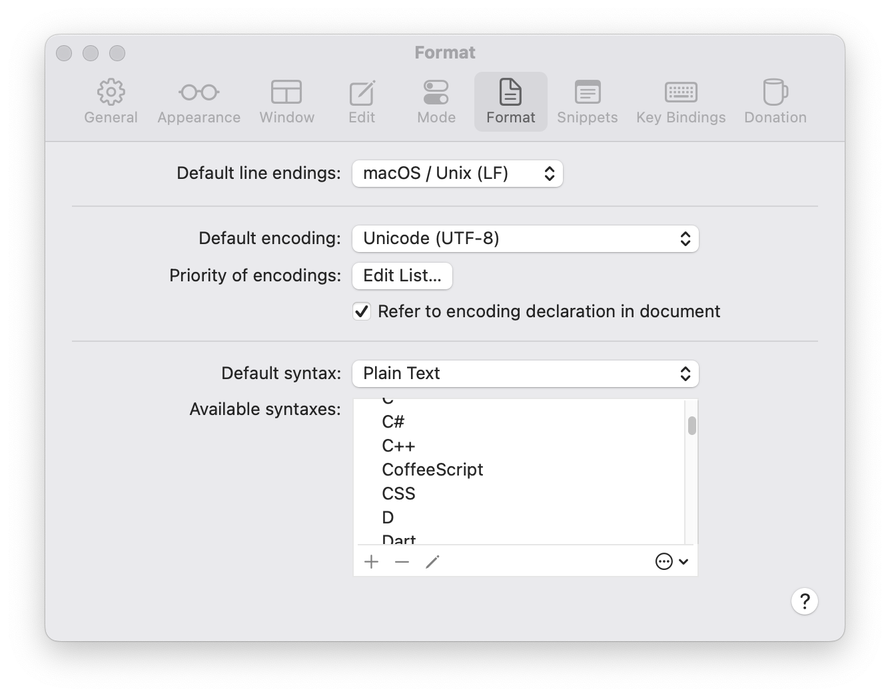
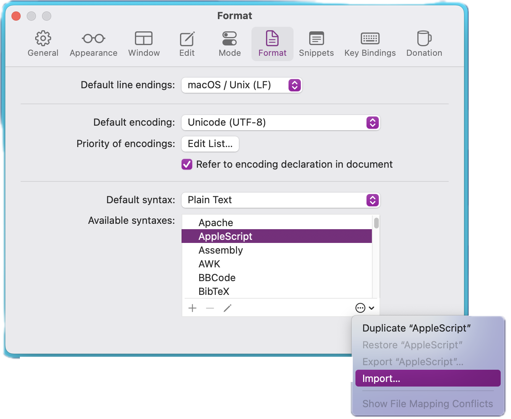
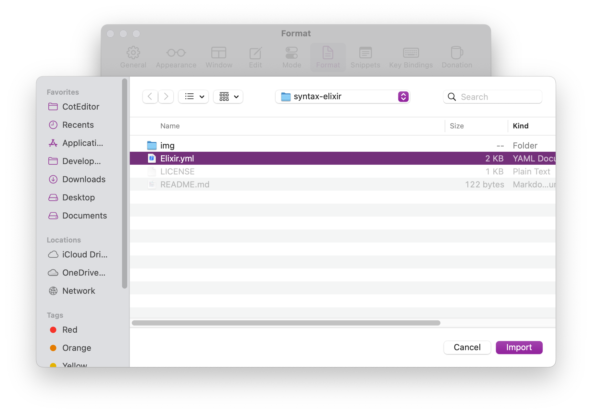
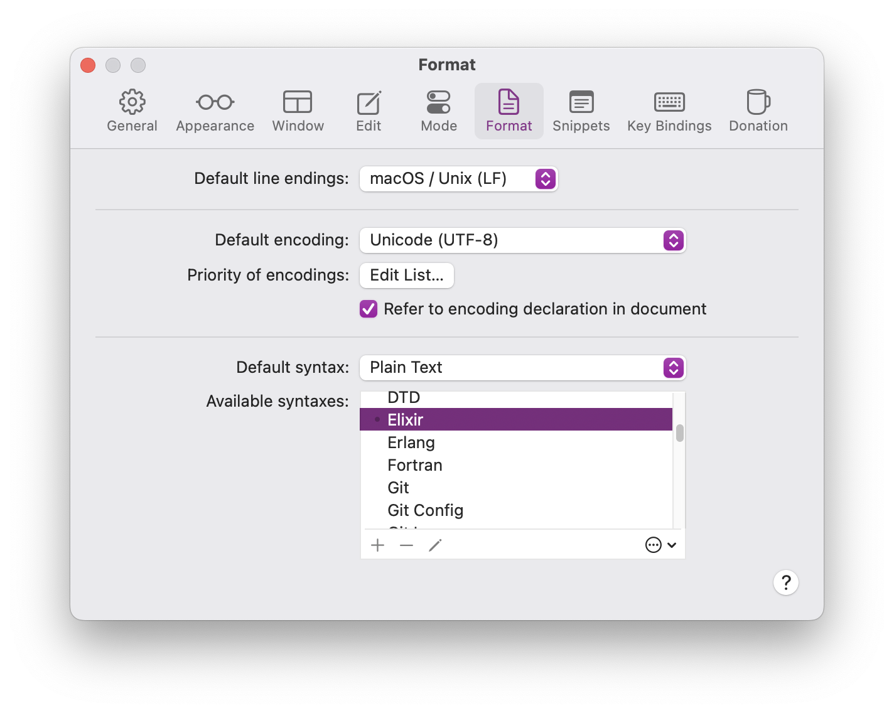

# 📐 Elixir Syntax for CotEditor
A syntax file for the Elixir programming language to be imported into the CotEditor application on MacOS

# 🏗️ Tasks
- [x] Create Elixir syntax file
- [x] Use syntax in CotEditor
- [ ] Propose PR for CotEditor to include it by default

# ⚙️ Installation
1. Clone the repo.
2. Open CotEditor.
3. Open the editor's Settings dialog from the _CotEditor_ menu, and then select the _Format_ icon. 

4. At the bottom of the list, choose the ellipsis (...) icon to display a menu. Select the _Import..._ item. 

5. Navigate to the file and select the `Elixir.yml` file. 

6. Once the dialog closes, scroll in the list of available syntaxes and verify you find _Elixir_ listed. 

# ⚖️ License
See [LICENSE](LICENSE)